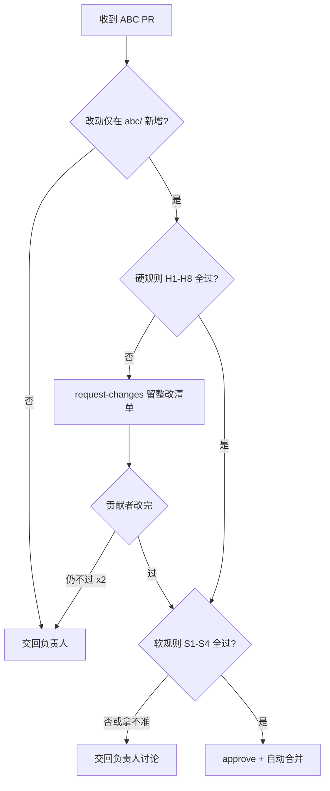

# ABC PR 审阅 SOP

> 状态：正式
> 受众：维护者、AI 审阅助手（ZCode）
> 本文规定 **ABC 类 PR 如何审阅、何时自动合并、何时交回负责人**。

ABC 贡献者按 [`contribute-abc-quickstart.md`](./contribute-abc-quickstart.md) 提交 PR；审阅方按下表流程处理。审阅依据是 [`abc-spec.md`](./abc-spec.md)（结构）与 [`desensitization-guide.md`](./desensitization-guide.md)（脱敏）。

## 1. 审阅 Checklist

每个 ABC PR 逐项过：

### 硬规则（机器/命令可判）

- [ ] **H1 路径合规**：改动仅在 `abc/<industry>/<id>/` 下新增
- [ ] **H2 JSON 合法**：`abc.json` 能被解析
- [ ] **H3 amt2abc 头齐全**：6 字段（id/name/industry/category/author/sanitized）存在且类型正确
- [ ] **H4 id 命名规范**：`<category>-<slug>`，全小写连字符，无中文空格
- [ ] **H5 id 全局唯一**：不与现有 `abc/**/abc.json` 的 id 冲突
- [ ] **H6 applicationInfo 脱敏**：id=`000000000000000000000000`、createAt=0、createBy=""
- [ ] **H7 脱敏关键词扫描零命中**：按 desensitization-guide 第 4 节正则扫，命中需人工判断
- [ ] **H8 配备 README**：含接口契约 + 脱敏记录

### 软规则（需语义判断）

- [ ] **S1 字段语义化**：inputs/outputs/methods/global 名称无设备/工位编码痕迹
- [ ] **S2 文案脱敏**：ui 文案、i18n、description 无客户/设备/人名
- [ ] **S3 preload 干净**：script/style 无内网 URL
- [ ] **S4 有复用价值**：不是一次性脚本，是可复用能力

## 2. 风险分级：自动合并 vs 交回负责人

> [!important] 自动合并的授权边界
> **仅当**改动符合下表「自动合并」全部条件时，AI 可直接合并。任一不满足 → 出审阅结论后交回负责人讨论，**不自动合并**。

| 判定项 | 自动合并 ✅ | 交回负责人 ⚠️ |
|--------|------------|--------------|
| **改动范围** | **仅新增** `abc/<industry>/<id>/` 目录 | 触及 `docs/`、根目录、CI、`.github/`，或**修改**现有文件 |
| **硬规则** | H1–H8 全通过 | 任一不过 |
| **软规则** | S1–S4 全通过 | S4 无复用价值，或 S1–S3 拿不准 |
| **脱敏** | 机器扫描零命中 + 语义复查通过 | 疑似泄露、判断不准 |

> [!warning] AI 不得自审自合
> AI 自己提交的 PR（如文档类、CI 类），无论是否满足上述条件，**一律不自动合并**，必须交人类负责人审阅合并。

### 判定流程图



## 3. 审阅执行（gh 命令）

> 假设 `gh` 已登录（见 Obsidian「ABC 开源贡献审阅机制」）。Windows Git Bash 需用全路径 `"/c/Program Files/GitHub CLI/gh.exe"` 或把该目录加入 PATH。

### 3.1 拉取并查看 PR

```bash
# 列出待审 PR
gh pr list --state open

# 看某个 PR 的元信息 + diff
gh pr view <PR号>
gh pr diff <PR号>

# 本地检出 PR 分支细看
gh pr checkout <PR号>
```

### 3.2 通过 → approve + 合并（低风险自动合并）

```bash
# 审阅通过留言
gh pr review <PR号> --approve --body "✅ 审阅通过：<逐项结论>"

# squash 合并 + 删分支
gh pr merge <PR号> --squash --delete-branch
```

### 3.3 需整改 → request-changes

```bash
gh pr review <PR号> --request-changes --body "<整改清单，见模板>"
```

### 3.4 整改留言模板

```markdown
感谢贡献！审阅发现以下问题，请在**本分支**上修改后推送（PR 会自动更新，勿新开 PR）：

**硬规则**
- [ ] H6: `applicationInfo.id` 需改为 `000000000000000000000000`
- [ ] H6: `applicationInfo.createAt` 需置为 `0`

**软规则**
- [ ] S1: `inputs` 中 `dp1_temp_zk01` 请语义化为 `temperature`

**脱敏**
- [ ] 第 42 行疑似客户名，请替换为 `CustomerA`

参考：[abc-spec](../abc-spec.md) · [desensitization-guide](../desensitization-guide.md)
```

## 4. 合并后的收尾

- [ ] 确认分支已删除
- [ ] （abc-registry 落地后）更新 `abc-registry/index.json` 索引
- [ ] 在 PR 留「已合并」的简短结语

## 5. 交回负责人的情形（AI 不自行决定）

以下情形 AI 只给审阅结论和建议，**决定权交人类负责人**：

1. 改动超出 `abc/` 新增范围（docs/根目录/CI/改现有文件）
2. 软规则拿不准（如字段是否敏感、是否值得入库）
3. 贡献者来回整改 ≥2 次仍不通过
4. 严重脱敏泄露（可能需要直接关 PR）
5. AI 自己提交的 PR

## 6. 相关

- [`abc-spec.md`](./abc-spec.md) — 结构标尺
- [`desensitization-guide.md`](./desensitization-guide.md) — 脱敏标尺
- [`contribute-abc-quickstart.md`](./contribute-abc-quickstart.md) — 贡献者视角
- [`proposal-abc-pipeline.md`](./proposal-abc-pipeline.md) — 流水线总方案
