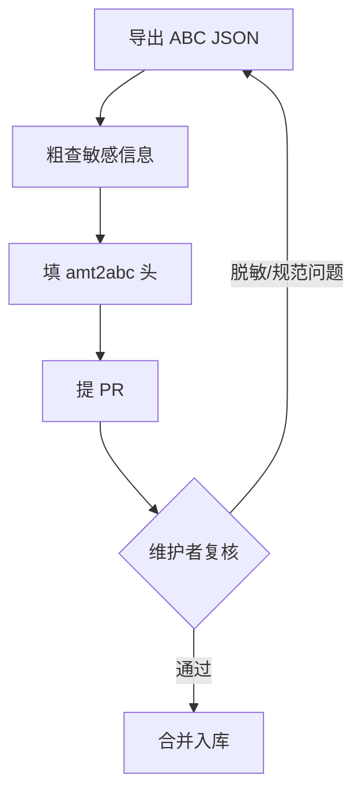

# ABC 开源贡献流水线方案

> 状态：草案
> 作者：iAAB
> 日期：2026-06-23

## 1. 目标

建立一条 ABC 贡献流水线，把团队产出的优质 ABC 经脱敏后沉淀为开源资产。

## 2. 核心思路：分工

为降低贡献门槛，流程按角色拆分。**贡献者只做最少的事，复杂度全部由维护者承担。**

| | 贡献者（团队成员） | 维护者 |
|---|---|---|
| 做什么 | 导出 ABC → 粗查敏感信息 → 填 `amt2abc` 头 → 提 PR | 脱敏复核 → 规范校验 → 合并入库 |
| 要懂 git/GitHub 吗 | 只要会"改文件 + 提 PR"两步（见快速指南） | 全套 |

> 普通贡献者只需阅读 [`contribute-abc-quickstart.md`](./contribute-abc-quickstart.md)，按步骤照做即可。

## 3. 仓库结构

```
abc/<industry>/<capability-slug>/
  ├── abc.json          # 脱敏后的 ABC（amt2abc 头 + 原始 DSL）
  ├── README.md         # 能力说明 + 脱敏记录
  └── examples/         # 输入/输出示例
abc-registry/index.json # ABC 索引（维护者维护）
```

- `<industry>`：行业/产线，如 `die-casting`；通用组件用 `general`
- `<capability-slug>`：小写语义化，如 `form-simple-input-submit`

## 4. ABC 结构

ABC 是一段可运行的低代码 Module DSL，提交时在最外层包一个 `amt2abc` 元信息头：

```
abc.json = {
  "amt2abc": { ... },          ← 贡献者填（见下）
  "applicationInfo": { ... },  ← 原始模块元数据
  "applicationDSL": { ... }    ← 原始可运行定义
}
```

`amt2abc` 头字段（**贡献者必填**）：

| 字段 | 说明 | 示例 |
|------|------|------|
| `id` | 全局唯一，`<category>-<slug>` | `form-simple-input-submit` |
| `name` | 中文名 | `简单输入表单 ABC` |
| `industry` | 行业/产线 | `die-casting` / `general` |
| `category` | 能力类型 | `form` / `monitoring` / `control` |
| `author` | 署名 | `zylliondata` |
| `sanitized` | 是否已自查脱敏 | `true` |

> 完整字段与 Schema 规范见 [`abc-spec.md`](./abc-spec.md)（维护者参考）。

## 5. 提交流程



**贡献者四步**：导出 → 粗查 → 填头 → 提 PR。详见快速指南。

**维护者**：复核脱敏 → 校验规范 → 合并 → 更新 `abc-registry/index.json`。

## 6. 脱敏原则

脱敏是 ABC 进仓库的**前置必要条件**。

- **贡献者**：导出后粗查，确保无客户名、IP、真实字段名、人名等。
- **维护者**：逐字段复核，重点 `inputs/outputs/methods/event/global/ui`，任何疑似泄露一律打回。

> 任何脱敏遗漏导致信息泄露，责任由提交者承担。

## 7. 相关文档

**贡献者**：

- [`contribute-abc-quickstart.md`](./contribute-abc-quickstart.md) — 快速指南（普通用户看这个）

**维护者**：

- [`abc-spec.md`](./abc-spec.md) — ABC 完整规范（审阅结构标尺）
- [`desensitization-guide.md`](./desensitization-guide.md) — 脱敏详细指南（审阅脱敏标尺）
- [`pr-review-sop.md`](./pr-review-sop.md) — PR 审阅 SOP（何时合并、何时交回）
